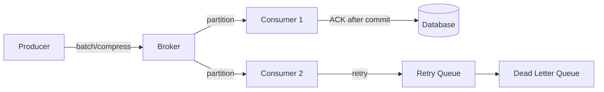

# 메시지 큐와 성능 최적화

- **목표를 먼저 정의한다:** 처리량(throughput), 지연시간(latency), 순서 보장, 내구성 사이에는 트레이드오프가 있다.
- **병목은 생산자·브로커·소비자 중 어디서 발생하는지 측정한다:** 큐 길이, 처리율, 소비 지연, 재처리율을 함께 본다.
- **고성능의 핵심은 배치·병렬성·백프레셔다:** 단, 중복 처리와 순서 보장 조건을 훼손하지 않아야 한다.

## 개념 설명

메시지 큐는 생산자와 소비자를 분리해 비동기적으로 데이터를 전달하는 중간 계층이다. 생산자는 요청을 큐에 넣고 즉시 반환할 수 있으며, 소비자는 자신의 처리 속도에 맞춰 메시지를 가져간다. 따라서 트래픽 급증을 흡수하고 서비스 간 결합도를 낮추는 데 유용하다.

성능은 보통 `처리량 = 메시지 크기 × 초당 처리 건수`로 평가한다. 네트워크 왕복과 디스크 I/O를 줄이려면 한 건씩 전송하기보다 **배치 처리**를 사용한다. 다만 배치 크기가 지나치게 크면 대기 시간이 증가하므로 최대 배치 크기와 대기 시간을 함께 제한해야 한다. 압축은 네트워크 비용을 줄이지만 CPU 사용량과 압축 지연을 증가시킨다.

소비자는 파티션 또는 큐를 여러 워커가 병렬 처리하도록 확장할 수 있다. 이때 파티션 수가 병렬성의 상한이 되며, 키 기반 라우팅을 사용하면 같은 키의 순서를 유지할 수 있다. 전체 메시지의 전역 순서와 높은 처리량은 동시에 얻기 어렵다.

소비가 느릴 때는 무제한으로 메시지를 가져오지 말고 **백프레셔**를 적용해야 한다. 프리페치 수, 동시 처리 수, 큐의 최대 적재량을 제한하면 메모리 고갈을 방지할 수 있다. ACK는 처리 완료 후 보내야 하며, ACK 이전 장애는 재전달을 유발한다. 따라서 대부분의 시스템은 최소 한 번 전달을 사용하고, 소비자 로직을 멱등적으로 설계한다. 중복 제거 키나 Inbox 테이블이 실용적이다.

내구성이 중요하면 디스크 저장, 복제, 높은 ACK 수준을 선택하지만 지연시간은 증가한다. 반대로 로그나 통계처럼 일부 유실이 허용되면 비동기 ACK와 짧은 보존 기간으로 성능을 높일 수 있다. 운영에서는 큐 길이, oldest message age, 소비자 lag, 재시도율, DLQ 크기, 처리시간의 p95·p99를 모니터링한다.

## 코드 예시

```python
producer = Producer({
    "bootstrap.servers": "broker:9092",
    "acks": "all",
    "compression.type": "lz4",
    "linger.ms": 5,
    "batch.size": 64 * 1024,
})
for event in events:
    producer.produce(
        "orders", key=event["user_id"],
        value=json.dumps(event), on_delivery=callback
    )
    if producer.outq_len() > 10000:
        producer.poll(0.1)  # 생산자 백프레셔
producer.flush()
```

## 처리 흐름



## 면접 질문

### 1. 메시지 큐의 처리량을 높이는 방법은?

배치 전송과 배치 소비를 적용하고, 파티션 및 소비자 워커를 늘려 병렬성을 확보한다. 압축으로 네트워크 비용을 줄이고, ACK·내구성 수준은 요구사항에 맞게 조정한다. 단, 큐 적체와 소비자 처리시간을 함께 측정해야 한다.

### 2. 메시지 중복 처리에 어떻게 대응하는가?

최소 한 번 전달에서는 중복을 전제로 한다. 메시지 ID나 비즈니스 키를 저장하고, DB의 유니크 제약 또는 Inbox 패턴으로 이미 처리한 메시지를 건너뛴다. 외부 API 호출은 멱등 키를 사용한다.

> **한 줄 정리:** 메시지 큐 성능 최적화는 배치와 병렬 처리로 처리량을 높이되, 백프레셔·멱등성·관측성으로 안정성을 지키는 작업이다.
