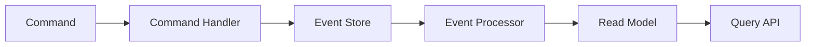

# 이벤트 소싱과 CQRS

- **이벤트 소싱(Event Sourcing)**: 현재 상태만 저장하지 않고, 상태를 만든 모든 사건(Event)을 순서대로 저장한다.
- **CQRS**: 데이터를 변경하는 모델(Command)과 조회하는 모델(Query)을 분리한다.
- 둘은 함께 사용할 수 있지만 필수 조합은 아니다. 이벤트 소싱은 저장 방식이고, CQRS는 시스템 구조다.

## 개념 설명

일반적인 시스템은 은행 계좌에 `잔액 = 10,000원`처럼 현재 결과를 저장한다. 편리하지만 “왜 이 금액이 되었는가?”라는 변경 이력을 알기 어렵다.

이벤트 소싱은 통장에 거래 내역을 쌓는 방식과 비슷하다. `입금 10,000원`, `출금 3,000원`을 이벤트로 저장하고, 이를 처음부터 재생(replay)해 현재 잔액을 계산한다. 이벤트는 이미 발생한 사실이므로 수정하거나 삭제하기보다 새로운 보정 이벤트를 추가한다. 덕분에 감사 로그, 장애 분석, 과거 시점 복원이 쉽다. 반면 이벤트가 많으면 재생 비용이 커지므로 스냅샷을 함께 사용하기도 한다.

CQRS는 식당의 주문 창구와 조회 창구를 나누는 비유로 이해할 수 있다. 주문 창구는 “상품을 구매하라” 같은 명령을 검증하고 데이터를 변경한다. 조회 창구는 “현재 주문 상태를 보여 달라”에 최적화된다. 읽기와 쓰기의 요구사항, 데이터베이스, 확장 전략이 다를 때 유용하다.

두 개념을 함께 적용하면 명령이 이벤트를 만들고, 이벤트가 읽기 전용 모델을 갱신한다. 예를 들어 `상품 구매` 명령이 성공하면 `상품 구매됨` 이벤트를 저장하고, 이벤트 처리기가 주문 목록과 통계용 조회 테이블을 갱신한다. 다만 이벤트 순서, 중복 처리, 스키마 변경, 최종적 일관성을 설계해야 한다. 단순한 CRUD 서비스에는 복잡도만 늘 수 있다.

```java
void handle(BuyProduct cmd) {
    Order order = repository.load(cmd.orderId());
    order.buy(cmd.productId());
    eventStore.append(order.uncommittedEvents());
}
```



## 면접 질문

### 1. 이벤트 소싱의 장단점은?

모든 변경 이력을 보존해 감사와 복원이 쉽다는 장점이 있다. 반면 이벤트 재생 비용, 이벤트 스키마 버전 관리, 중복·순서 처리 등 구현 복잡도가 커진다.

### 2. CQRS를 언제 적용하는가?

읽기와 쓰기의 트래픽이나 모델이 크게 다르고, 각각 독립적인 확장이 필요할 때 적용한다. 단순 CRUD에 무조건 적용하면 운영 복잡도와 최종적 일관성만 증가할 수 있다.

> **한 줄 정리:** 이벤트 소싱은 “무슨 일이 일어났는가”를 저장하고, CQRS는 “변경”과 “조회”의 책임을 나누는 설계다.
