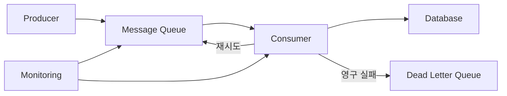

# 메시지 큐와 실무 트러블슈팅

- **핵심 1:** 메시지 큐는 생산자와 소비자를 분리해 트래픽을 완충하고 비동기 처리를 가능하게 한다.
- **핵심 2:** 장애의 핵심 지표는 큐 적체량, 처리 지연, 소비자 처리율, 재시도 횟수, DLQ 유입량이다.
- **핵심 3:** 중복 전달은 정상적으로 발생할 수 있으므로 소비자는 멱등성을 보장해야 한다.

## 개념 설명

메시지 큐는 Producer가 메시지를 Broker에 넣고, Consumer가 나중에 가져가 처리하는 구조다. HTTP 동기 호출과 달리 생산자는 소비자의 처리 완료를 기다리지 않으므로 응답 시간을 줄이고 서비스 간 결합도를 낮출 수 있다. 대신 최종 일관성, 중복 처리, 순서 보장, 메시지 유실을 고려해야 한다.

실무에서 가장 흔한 문제는 **큐 적체**다. 생산 속도가 소비 속도보다 빠르면 `queue depth`가 증가한다. 이때 소비자 인스턴스를 늘리기 전에 메시지 처리 시간이 증가했는지, 외부 API나 DB가 느려졌는지 확인해야 한다. 소비자를 무작정 늘리면 DB 커넥션 고갈이나 외부 시스템 과부하가 발생할 수 있다. 처리율, 메시지 age, consumer lag를 함께 확인하고 적절한 오토스케일링 기준을 정한다.

메시지를 처리한 뒤 `ack`해야 큐에서 제거된다. 처리 중 장애가 발생해 ack하지 않으면 메시지가 재전달될 수 있다. 따라서 DB 저장, 결제 요청 같은 작업은 주문 ID나 이벤트 ID를 기준으로 중복 실행을 막아야 한다. 재시도 가능한 오류와 잘못된 데이터 같은 영구 오류를 구분하고, 일정 횟수 이상 실패한 메시지는 **DLQ(Dead Letter Queue)**로 보내 조사한다.

순서가 중요하면 파티션 키나 단일 소비자 등 명시적인 전략이 필요하다. 또한 메시지 본문에 스키마 버전, correlation ID, 생성 시각을 포함하면 장애 추적과 호환성 관리가 쉬워진다. 모니터링에는 적체량뿐 아니라 oldest message age, 성공·실패율, 재시도율, DLQ 크기, 처리 latency를 포함한다.

## 코드 예시: 멱등 소비자와 재시도

```python
def consume(msg):
    event_id = msg["event_id"]
    if processed.exists(event_id):
        ack(msg)
        return

    try:
        with db.transaction():
            process_business_logic(msg)
            processed.insert(event_id)
        ack(msg)
    except RetryableError:
        nack(msg, requeue=True)
    except Exception:
        send_to_dlq(msg)
        ack(msg)
```

## 처리 흐름



## 면접 질문

1. **메시지 큐에서 중복 처리가 발생하는 이유와 대응 방법은?**  
   소비자가 처리 후 ack하기 전에 장애가 나면 브로커가 재전달할 수 있다. 이벤트 ID 기반 중복 저장 방지, 멱등 API, 트랜잭션 또는 원자적 상태 기록으로 대응한다.

2. **큐 적체가 발생했을 때 어떤 순서로 확인하는가?**  
   생산·소비 처리율과 oldest message age를 비교하고, 소비자 오류율·처리 시간·외부 DB/API 상태를 확인한다. 이후 병렬도를 조절하되 하류 시스템의 용량을 넘지 않게 확장한다.

> **한 줄 정리:** 메시지 큐 운영의 핵심은 빠른 전달보다 중복·재시도·적체·실패를 안전하게 처리하는 것이다.
