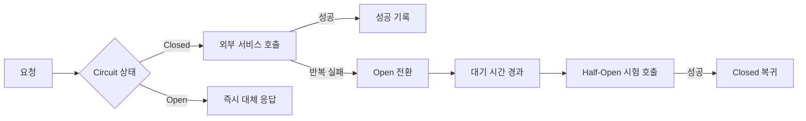

# Circuit Breaker 패턴

- 장애가 난 외부 서비스로 요청이 계속 몰리는 것을 막는다.
- 실패 횟수에 따라 `Closed → Open → Half-Open` 상태로 전환한다.
- 빠른 실패와 대체 응답으로 전체 시스템의 연쇄 장애를 줄인다.

## 개념 설명

Circuit Breaker는 전기 회로의 **차단기**와 비슷하다. 전기가 과도하게 흐르면 차단기가 내려가 더 큰 사고를 막듯이, 특정 서비스 호출이 반복해서 실패하면 해당 호출을 잠시 차단한다.

예를 들어 쇼핑몰이 결제 서비스에 요청한다고 하자. 결제 서버가 고장 났는데도 모든 사용자의 요청을 계속 전달하면, 연결 대기와 재시도가 쌓여 쇼핑몰 서버까지 느려질 수 있다. Circuit Breaker는 실패가 일정 횟수 이상 발생하면 회로를 `Open` 상태로 바꾼다. 이후 요청은 외부 서비스에 보내지 않고 즉시 실패 처리하거나 “잠시 후 다시 시도해 주세요” 같은 대체 응답을 반환한다.

상태는 세 가지다.

- **Closed**: 정상 상태다. 요청을 전달하고 실패 횟수를 기록한다.
- **Open**: 장애가 의심되는 상태다. 일정 시간 동안 호출을 차단한다.
- **Half-Open**: 복구 여부를 확인하는 상태다. 소수의 요청만 시험한다. 성공하면 `Closed`, 실패하면 다시 `Open`으로 돌아간다.

실패로 판단할 기준에는 연결 오류, 타임아웃, HTTP 5xx 등이 있다. 단순히 한 번 실패했다고 차단하면 일시적인 네트워크 문제에도 서비스가 멈출 수 있으므로, 실패율·연속 실패 횟수·차단 시간 같은 설정을 신중히 정해야 한다. 또한 로그, 메트릭, 알림을 함께 제공해야 실제 장애 원인을 추적할 수 있다.

```java
if (state == OPEN && !cooldownExpired()) return fallback();
try {
    Response r = callPayment();
    recordSuccess();
    return r;
} catch (TimeoutException e) {
    recordFailure();
    if (failureCount() >= 5) state = OPEN;
    return fallback();
}
```



## 면접 질문

### 1. Circuit Breaker와 Retry는 어떻게 다른가?

Retry는 실패한 요청을 다시 시도하는 기법이고, Circuit Breaker는 실패가 누적될 때 요청 자체를 차단하는 기법이다. Retry를 무분별하게 사용하면 장애 서비스에 부하를 더 줄 수 있으므로 두 패턴을 함께 쓸 때는 횟수와 백오프를 제한해야 한다.

### 2. 왜 Open 상태에서 바로 Closed로 복구하지 않고 Half-Open을 거치는가?

서비스가 실제로 복구됐는지 확인하지 않고 모든 요청을 재개하면 장애가 반복될 수 있다. Half-Open에서 소수의 시험 요청만 보내 안전하게 복구 여부를 검증한다.

## 한 줄 정리

Circuit Breaker는 장애 난 서비스로 향하는 요청을 잠시 끊어 연쇄 장애를 막는 안전장치다.
