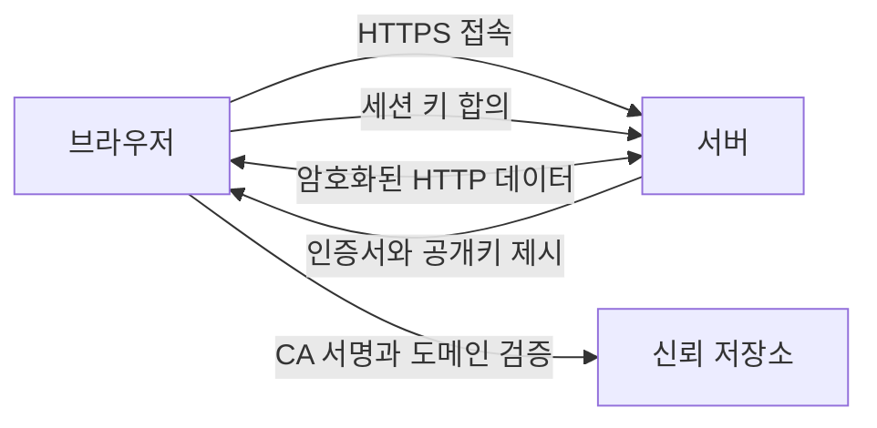

# HTTPS와 인증서

- **HTTPS = HTTP + TLS**: 통신 내용을 암호화해 도청을 막는다.
- **인증서의 핵심 역할**: 접속한 서버가 진짜 `example.com`인지 증명한다.
- **TLS 핸드셰이크 후**: 공개키 암호로 안전하게 세션 키를 교환하고, 실제 데이터는 빠른 대칭키로 주고받는다.

## 개념 설명

HTTPS는 인터넷 우체국의 **안전한 등기 우편**과 비슷하다. HTTP가 엽서라면 누구나 내용을 볼 수 있지만, HTTPS는 봉투에 넣어 보내므로 중간 사람이 내용을 읽기 어렵다. 또한 봉투가 도중에 바뀌었는지도 확인할 수 있다.

여기서 **인증서**는 서버의 신분증이다. 인증서에는 도메인 이름, 서버의 공개키, 발급 기관, 유효 기간 등이 들어 있다. 브라우저가 `https://example.com`에 접속하면 인증서의 도메인과 실제 주소가 일치하는지, 만료되지 않았는지, 신뢰할 수 있는 인증 기관이 서명했는지 검사한다.

인증 기관인 **CA**는 주민등록증을 발급하는 공공기관처럼 서버의 신원을 확인하고 인증서에 전자서명한다. 브라우저는 미리 신뢰하는 CA 목록을 가지고 있으므로, CA의 서명을 검증해 위조 인증서를 걸러낸다.

TLS 핸드셰이크에서는 서버가 인증서를 제시한다. 브라우저는 이를 검증한 뒤 공개키를 이용해 안전하게 세션 키를 합의한다. 이후 요청과 응답은 세션 키를 사용하는 대칭키 암호로 처리한다. 이 방식은 공개키 암호의 안전성과 대칭키 암호의 속도를 함께 얻는다.

다만 HTTPS가 모든 보안을 보장하지는 않는다. 피싱 사이트도 유효한 인증서를 발급받을 수 있으므로, 사용자는 도메인 철자를 확인해야 한다. 또한 서버 내부에 저장된 개인정보나 이미 탈취된 계정까지 HTTPS가 보호해 주지는 않는다.

```bash
# 인증서와 TLS 연결 정보를 확인
curl -v https://example.com

# 인증서의 발급자, 유효 기간, 도메인 확인
openssl s_client -connect example.com:443 -servername example.com </dev/null 2>/dev/null \
  | openssl x509 -noout -issuer -subject -dates
```



## 면접 질문

### 1. 인증서와 공개키의 관계는 무엇인가요?

인증서는 서버의 도메인 정보와 공개키를 묶고, CA가 전자서명한 문서다. 공개키만으로는 “이 키가 정말 해당 서버의 것인지” 알 수 없지만, 인증서와 CA 서명을 통해 신원을 검증할 수 있다.

### 2. HTTPS에서도 대칭키와 비대칭키를 함께 사용하는 이유는 무엇인가요?

비대칭키 암호는 안전한 키 교환에 유리하지만 계산 비용이 크다. 따라서 핸드셰이크에서는 비대칭키를 사용하고, 실제 대량 데이터 통신은 빠른 대칭키로 처리한다.

## 한 줄 정리

**HTTPS는 인증서로 서버의 신원을 확인한 뒤, 암호화된 통신 통로를 만드는 기술이다.**
