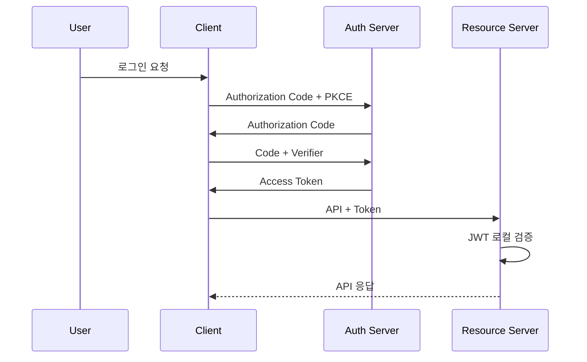

# OAuth 2.0 성능 최적화

- **인가 코드 + PKCE**를 기본으로 사용하고, 액세스 토큰은 짧게 유지하며 리프레시 토큰으로 갱신한다.
- 매 요청마다 인증 서버에 토큰 검증을 요청하기보다, 가능하면 **JWT 서명과 만료 시간을 리소스 서버에서 로컬 검증**한다.
- JWKS, 토큰 메타데이터, 사용자 세션을 적절히 캐시하고, 토큰 발급 요청에는 **HTTP 연결 재사용과 동시 갱신 제어**를 적용한다.

## 개념 설명

OAuth 2.0은 사용자가 비밀번호를 애플리케이션에 직접 제공하지 않고, 리소스 소유자가 특정 권한을 위임하는 인가 프레임워크다. 주요 역할은 사용자, 클라이언트, 인가 서버, 리소스 서버로 나뉜다. 클라이언트는 인가 서버에서 액세스 토큰을 받은 뒤 API 호출에 사용한다.

일반적인 웹·모바일 로그인에는 Authorization Code Grant와 PKCE 조합이 적합하다. 클라이언트는 `code_verifier`의 해시를 인가 요청에 포함하고, 토큰 교환 시 원문을 제출한다. 따라서 인가 코드가 탈취되어도 원래 클라이언트가 아니면 토큰으로 바꾸기 어렵다. Implicit Grant는 토큰 노출 위험과 갱신 제약 때문에 피한다.

성능 측면에서 JWT는 리소스 서버가 공개키로 서명을 검증할 수 있어 요청마다 인증 서버를 호출하지 않아도 된다. 대신 공개키(JWKS)를 메모리나 분산 캐시에 저장하고 `kid`가 바뀔 때만 갱신한다. JWT 폐기가 즉시 필요하거나 권한 변경이 빈번하면 토큰 인트로스펙션을 사용할 수 있지만, 네트워크 지연과 인증 서버 부하가 추가된다. 이 경우 짧은 TTL의 검증 결과 캐시를 고려한다.

토큰 엔드포인트 호출은 커넥션 풀, Keep-Alive, 타임아웃, 재시도 정책을 설정한다. 액세스 토큰 만료 직전에 여러 요청이 동시에 갱신하지 않도록 단일 비행(single-flight) 잠금이나 분산 락을 사용한다. 캐시에는 액세스 토큰 자체뿐 아니라 만료 시각을 저장하고, 만료 직전의 작은 여유 시간(skew)을 둔다. 단, 토큰을 로그·URL·브라우저 로컬 스토리지에 노출하지 않는다.

## 코드 예시

```javascript
async function getAccessToken() {
  const cached = await redis.get("oauth:access");
  if (cached && cached.exp - Date.now() > 30_000) return cached.token;

  return singleFlight("oauth-refresh", async () => {
    const latest = await redis.get("oauth:access");
    if (latest && latest.exp - Date.now() > 30_000) return latest.token;

    const token = await fetchTokenWithKeepAlive(); // connection pooling
    await redis.set("oauth:access", {
      token: token.access_token,
      exp: Date.now() + token.expires_in * 1000
    }, { EX: token.expires_in - 30 });
    return token.access_token;
  });
}
```

## 인증 및 토큰 흐름



## 면접 질문

### 1. JWT 검증을 매번 인증 서버에 위임하지 않는 이유는?

네트워크 왕복 지연과 인증 서버 부하를 줄일 수 있기 때문이다. 리소스 서버가 JWKS를 캐시하고 JWT 서명, `iss`, `aud`, `exp`를 로컬 검증하면 높은 처리량을 얻는다. 다만 즉시 폐기가 필요하면 인트로스펙션이나 짧은 만료 시간을 함께 사용한다.

### 2. 여러 요청이 동시에 리프레시 토큰을 사용하면 어떤 문제가 생기는가?

동일한 토큰 교환이 중복 발생하고, 리프레시 토큰 회전 정책에서는 한 요청만 성공해 나머지가 실패할 수 있다. 분산 락이나 single-flight로 갱신을 직렬화하고, 새 토큰을 캐시에 원자적으로 저장한다.

> **한 줄 정리:** OAuth 2.0 성능 최적화의 핵심은 로컬 JWT 검증, 캐시, 연결 재사용, 중복 갱신 방지이며 보안 설정을 희생해서는 안 된다.
