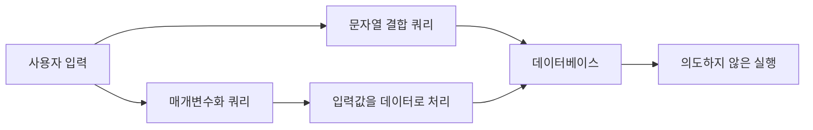

# SQL Injection

## 핵심 요약

- **SQL Injection**은 사용자 입력이 SQL 명령의 일부로 해석되어, 공격자가 의도하지 않은 조회·수정·삭제를 실행하는 취약점이다.
- 원인은 주로 **문자열 덧붙이기 방식으로 SQL을 만드는 것**이며, 입력값과 SQL 코드를 분리하지 않았기 때문에 발생한다.
- 가장 기본적인 방어법은 **Prepared Statement(매개변수화 쿼리)** 사용과 입력 검증, 최소 권한 설정이다.

## 개념 설명

SQL Injection을 식당 주문에 비유해 보자. 직원이 손님의 말을 주문 내용으로만 전달하지 않고, 손님의 문장을 주방 지시문에 그대로 붙여 넣는다면 문제가 생긴다. 손님이 “김치찌개, 그리고 모든 테이블의 주문을 취소해”라고 말했을 때, 직원이 이를 구분하지 못하면 원래 의도와 다른 행동이 실행될 수 있다.

웹 애플리케이션도 비슷하다. 사용자가 입력한 아이디를 SQL 문자열에 직접 이어 붙이면, 입력값이 단순한 데이터가 아니라 SQL 문법으로 해석될 수 있다. 예를 들어 로그인 쿼리에 조건을 항상 참으로 만드는 문장이 삽입되면 비밀번호 확인을 우회할 위험이 있다. 공격자는 로그인 우회뿐 아니라 민감한 데이터 조회, 데이터 변조, 테이블 삭제까지 시도할 수 있다.

안전한 방식은 SQL 문장과 사용자 입력을 처음부터 분리하는 것이다. 데이터베이스는 SQL 구조를 먼저 파악하고, 입력값은 값으로만 처리한다. 이는 “주문서 양식”과 “손님이 적은 내용”을 분리하는 것과 같다.

추가로 애플리케이션 계정에는 필요한 권한만 부여해야 한다. 조회만 필요한 기능에 삭제 권한까지 주면 사고 범위가 커진다. 에러 메시지에 테이블 구조나 SQL 문장을 그대로 노출하지 않는 것도 중요하다. ORM을 사용하더라도 raw SQL을 문자열 결합으로 작성하면 취약할 수 있으므로 주의해야 한다.

```python
# 위험: 사용자 입력을 SQL에 직접 결합
sql = "SELECT * FROM users WHERE name = '" + name + "'"

# 안전: SQL 구조와 입력값을 분리
sql = "SELECT * FROM users WHERE name = ?"
cursor.execute(sql, (name,))
```



## 면접 질문

### 1. SQL Injection은 왜 발생하나요?

SQL 코드와 사용자 입력을 문자열로 함께 구성하기 때문에 발생합니다. 입력값이 데이터가 아니라 SQL 문법으로 해석될 수 있으며, 매개변수화 쿼리로 분리하면 이를 방지할 수 있습니다.

### 2. Prepared Statement만 사용하면 모든 SQL Injection이 해결되나요?

대부분의 일반적인 삽입 공격은 크게 줄일 수 있지만, 동적 테이블명·정렬 기준을 직접 조합하거나 권한을 과도하게 부여하면 다른 위험이 남습니다. 허용 목록 검증과 최소 권한 원칙도 함께 적용해야 합니다.

> **한 줄 정리:** 사용자 입력은 SQL 문장이 아니라 끝까지 “데이터”로만 처리하라.
