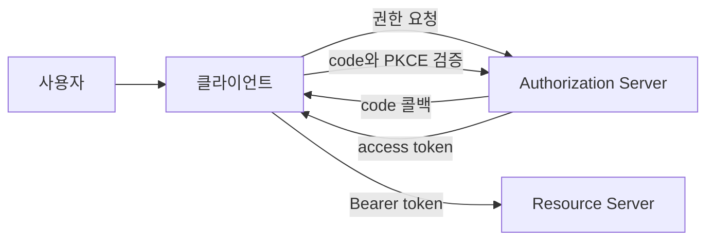

# OAuth 2.0 실무 트러블슈팅

- OAuth 2.0은 **사용자 인증 자체가 아니라 리소스 접근 권한 위임**을 위한 표준이다. 로그인 정보가 필요하면 OIDC를 함께 사용한다.
- 일반 웹 서비스는 **Authorization Code + PKCE** 흐름을 기본으로 사용하고, `client_secret`은 브라우저나 모바일 앱에 넣지 않는다.
- 장애의 핵심 원인은 대개 `redirect_uri`, `state`·`code_verifier`, 토큰 만료, 스코프, 서버 시간 차이, 프록시 설정이다.

## 개념 설명

OAuth에는 네 주체가 있다. 사용자가 권한을 승인하는 **Resource Owner**, 권한 서버인 **Authorization Server**, API를 호출하는 **Client**, 보호된 API인 **Resource Server**다. 클라이언트는 먼저 권한 서버로 사용자를 보낸다. 사용자가 승인하면 일회성 authorization code가 콜백으로 전달되고, 서버는 이를 access token으로 교환한다.

Authorization Code는 짧게 유효하며 API 호출에 직접 사용할 수 없다. Access token은 API 인증에 사용하고, Refresh token은 access token 재발급에 사용한다. 토큰을 URL이나 로그에 기록하면 탈취 위험이 있으므로 `Authorization: Bearer` 헤더를 사용한다.

실무에서는 콜백의 `state`를 세션에 저장한 값과 비교해 CSRF를 방어한다. PKCE는 로그인 시작 시 생성한 `code_verifier`에서 `code_challenge`를 만들고, 토큰 교환 때 원본 verifier를 제출하는 방식이다. `redirect_uri`는 등록값과 스킴, 호스트, 포트, 경로, 후행 슬래시까지 정확히 일치해야 한다.

트러블슈팅 시 먼저 브라우저 네트워크에서 authorization 요청과 콜백 파라미터를 확인한다. `invalid_grant`는 이미 사용한 code, 만료된 code, redirect URI 불일치, PKCE 불일치에서 자주 발생한다. `401`은 토큰 만료·잘못된 issuer·서명 키 불일치·서버 시간 오차를 확인하고, `403`은 대개 scope 또는 API 권한 부족이다. 리버스 프록시 뒤에서는 외부 HTTPS와 내부 HTTP가 달라 redirect URI가 잘못 생성되지 않는지도 점검한다.

```bash
# code_verifier는 로그인 시작 시 세션에 저장
curl -X POST https://idp.example.com/oauth/token \
  -d grant_type=authorization_code \
  -d code="$CODE" \
  -d redirect_uri="https://app.example.com/callback" \
  -d client_id="$CLIENT_ID" \
  -d code_verifier="$CODE_VERIFIER"
```



## 면접 질문

### 1. OAuth 2.0과 OIDC의 차이는?

OAuth 2.0은 API 접근 권한 위임이고, OIDC는 OAuth 위에 인증과 사용자 식별을 추가한 표준이다. OIDC는 보통 `id_token`과 UserInfo 엔드포인트를 제공한다.

### 2. `state`와 PKCE는 각각 무엇을 방어하는가?

`state`는 콜백 요청의 위조와 세션 혼동을 방어한다. PKCE는 authorization code가 탈취되어도 원래 클라이언트가 아니면 토큰으로 교환하지 못하게 한다.

> **한 줄 정리:** OAuth 장애는 흐름 자체보다 `redirect_uri`, PKCE 상태, 토큰 검증, scope와 프록시 설정을 순서대로 확인하면 빠르게 해결된다.
