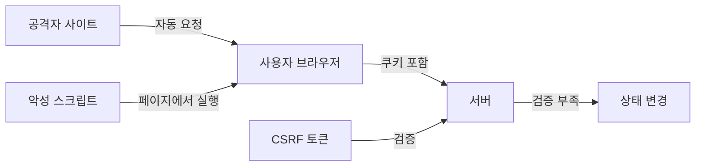

# XSS와 CSRF: 브라우저를 속이는 두 가지 공격

- **XSS**는 공격자가 웹 페이지에 악성 스크립트를 심어 다른 사용자의 브라우저에서 실행시키는 공격이다.
- **CSRF**는 사용자가 로그인한 상태를 악용해, 사용자가 원하지 않는 요청을 보내게 만드는 공격이다.
- 방어의 핵심은 **출력값 인코딩·CSP·HttpOnly 쿠키**와 **CSRF 토큰·SameSite 쿠키·Origin 검증**이다.

## 개념 설명

웹사이트를 하나의 은행 창구라고 생각해 보자. 사용자는 브라우저라는 대리인을 통해 창구와 대화한다.

**XSS(Cross-Site Scripting)**는 창구 게시판에 공격자가 “이 문장을 읽으면 비밀번호를 내놔!” 같은 자바스크립트를 몰래 붙이는 상황이다. 다른 사용자가 게시판을 보면 그 스크립트가 자신의 브라우저에서 실행된다. 공격자는 쿠키 탈취, 가짜 로그인 창 표시, 사용자 대신 API 호출 등을 할 수 있다.

XSS는 보통 세 종류로 나눈다. 저장형은 악성 코드가 게시글이나 DB에 저장되고, 반사형은 URL 파라미터 등이 즉시 응답에 포함된다. DOM 기반은 서버 응답과 무관하게 프런트엔드 코드가 안전하지 않은 방식으로 HTML을 조작한다. 사용자 입력은 `innerHTML`보다 `textContent`로 출력하고, 서버에서도 HTML 문맥에 맞게 인코딩해야 한다. CSP(Content Security Policy)는 실행 가능한 스크립트의 출처를 제한하는 추가 방어선이다.

**CSRF(Cross-Site Request Forgery)**는 공격자가 다른 사이트에 “은행에 송금 요청을 보내라”는 버튼을 숨겨 두는 상황이다. 사용자가 이미 은행에 로그인했고 브라우저가 쿠키를 자동으로 붙이면, 서버는 정상 사용자의 요청으로 오해할 수 있다. CSRF는 서버가 요청을 보낸 화면의 의도나 출처를 충분히 확인하지 않을 때 발생한다.

방어에는 서버가 발급한 **CSRF 토큰**을 폼이나 요청 헤더에 넣고 검증하는 방법이 대표적이다. 공격자는 사용자의 토큰을 알기 어렵다. 또한 쿠키에 `SameSite=Lax` 또는 `Strict`를 설정하고, 상태 변경 요청은 `POST`, `PUT`, `DELETE` 등을 사용하며 `Origin` 또는 `Referer`도 검증한다. 단, XSS가 존재하면 같은 페이지에서 토큰을 읽어 요청할 수 있으므로 CSRF 방어가 XSS 방어를 대신하지는 못한다.

## 코드 예시

```html
<!-- 위험: 입력을 HTML로 해석 -->
<div id="msg"></div>
<script>
  const value = new URLSearchParams(location.search).get("msg");
  document.querySelector("#msg").innerHTML = value;
</script>

<!-- 안전: 문자를 그대로 출력 -->
<script>
  document.querySelector("#msg").textContent = value;
</script>
```



## 면접 질문

### 1. XSS와 CSRF의 가장 큰 차이는 무엇인가?

**답변:** XSS는 공격 코드가 피해자의 브라우저에서 실행되는 공격이고, CSRF는 피해자의 인증 정보를 이용해 원치 않는 요청을 서버에 보내는 공격이다. XSS는 주로 출력 처리와 스크립트 실행 제한으로, CSRF는 토큰과 쿠키 정책으로 방어한다.

### 2. `HttpOnly` 쿠키는 XSS를 완전히 막는가?

**답변:** 아니다. 자바스크립트가 쿠키 값을 직접 읽는 것은 막지만, XSS 스크립트가 사용자의 브라우저에서 실행되는 것 자체는 막지 못한다. 따라서 요청 위조나 화면 조작은 여전히 가능하며, 출력 인코딩과 CSP가 함께 필요하다.

> **한 줄 정리:** XSS는 “악성 코드를 실행시키는 공격”, CSRF는 “정상 사용자인 척 요청을 보내는 공격”이며, 둘은 서로 다른 방어책이 필요하다.
