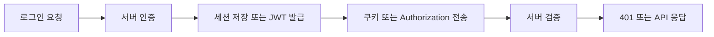

# JWT와 세션: 실무 트러블슈팅 중심 정리

- **세션**은 서버가 인증 상태를 보관하고, **JWT**는 클라이언트가 토큰을 보관하며 요청마다 전달한다.
- JWT는 확장성이 좋지만 **폐기, 탈취 대응, 토큰 만료 관리**가 어렵다. 세션은 중앙 제어가 쉽지만 저장소와 서버 간 공유가 필요하다.
- 인증 장애는 토큰 자체보다 **쿠키 속성, CORS, 만료 시간, 프록시 설정, 서버 시간 차이**에서 자주 발생한다.

## 개념 설명

세션 인증에서는 로그인 성공 후 서버가 세션 ID를 생성하고 Redis나 DB에 사용자 정보를 저장한다. 브라우저는 세션 ID를 쿠키로 보낸다. 서버는 요청마다 저장소를 조회하므로 로그아웃, 강제 만료, 권한 변경을 즉시 반영하기 쉽다. 대신 여러 서버가 있으면 공용 세션 저장소나 세션 스티키 라우팅이 필요하다.

JWT는 `header.payload.signature` 구조의 토큰이다. 서버는 서명과 만료 시간을 검증해 사용자 정보를 얻으며, 매 요청마다 저장소 조회가 없어 수평 확장에 유리하다. 그러나 발급된 JWT는 서버가 즉시 회수하기 어렵다. 따라서 짧은 수명의 액세스 토큰과, DB 또는 Redis에서 폐기 가능한 리프레시 토큰을 함께 사용한다.

브라우저 저장 위치는 보안과 편의성의 절충이다. `HttpOnly`, `Secure`, `SameSite=Lax 또는 Strict` 쿠키는 XSS로 토큰을 직접 읽는 위험을 줄인다. 다른 사이트에서 요청해야 한다면 `SameSite=None; Secure`와 정확한 CORS 설정이 필요하다. `Access-Control-Allow-Origin: *`와 credentials 조합은 허용되지 않는다.

실무에서 `401`은 토큰 누락·만료·서명 오류 같은 **인증 실패**, `403`은 인증은 되었지만 권한이 없는 **인가 실패**로 구분한다. 모든 401을 무조건 로그인 화면으로 보내면 만료와 서버 설정 오류를 놓치므로, 서버 로그에 실패 원인과 `kid`, 발급자, 만료 시각을 기록하되 토큰 원문은 기록하지 않는다. `exp` 오류가 간헐적이면 서버와 클라이언트의 시간 동기화, 초·밀리초 단위 혼동을 확인한다.

## 코드 예시

```js
function auth(req, res, next) {
  const token = req.cookies.accessToken;
  if (!token) return res.status(401).json({ code: "TOKEN_MISSING" });

  try {
    req.user = jwt.verify(token, process.env.JWT_SECRET, {
      issuer: "api.example.com",
      algorithms: ["HS256"]
    });
    next();
  } catch (err) {
    const code = err.name === "TokenExpiredError"
      ? "TOKEN_EXPIRED" : "TOKEN_INVALID";
    res.status(401).json({ code });
  }
}
```

## 인증 요청 흐름



## 면접 질문

### 1. JWT를 사용하면 로그아웃이 항상 즉시 반영되는가?

아니다. 이미 발급된 액세스 토큰은 만료 전까지 유효할 수 있다. 짧은 만료 시간, 리프레시 토큰 저장소, 블랙리스트 또는 토큰 버전 검사를 조합해 즉시 폐기 요구를 처리한다.

### 2. 쿠키는 전송되는데 인증이 실패하면 무엇을 확인하는가?

브라우저 개발자 도구에서 쿠키의 `Domain`, `Path`, `Secure`, `SameSite`, 만료 시간을 확인한다. 프런트 요청의 credentials 설정, 서버 CORS의 허용 origin과 credentials, HTTPS 및 프록시의 헤더 전달도 함께 점검한다.

**한 줄 정리:** 세션은 폐기와 중앙 통제가 쉽고 JWT는 확장성이 좋으므로, 보안 요구와 운영 환경에 맞춰 만료·저장·폐기 전략까지 설계해야 한다.
