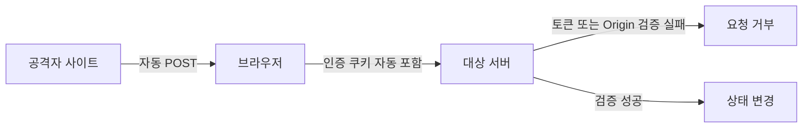

# XSS와 CSRF

- **XSS(Cross-Site Scripting)**: 공격자가 삽입한 스크립트가 피해자 브라우저에서 실행되는 취약점이다.
- **CSRF(Cross-Site Request Forgery)**: 피해자의 인증 쿠키를 악용해 원치 않는 요청을 보내는 공격이다.
- **핵심 방어**: XSS는 상황별 출력 인코딩과 안전한 DOM API, CSRF는 토큰·Origin 검증·SameSite 쿠키를 사용한다.

## 개념 설명

### XSS

XSS는 서버가 사용자 입력을 검증하거나 출력할 때 안전하게 처리하지 않아 발생한다. 공격자는 게시글, 댓글, 프로필 등에 `<script>` 또는 이벤트 핸들러를 삽입할 수 있다.

주요 유형은 다음과 같다.

- **Stored XSS**: 악성 스크립트가 DB에 저장되고, 다른 사용자가 페이지를 열 때 실행된다.
- **Reflected XSS**: 검색어 같은 입력이 즉시 응답에 포함되어 실행된다.
- **DOM-based XSS**: 서버 응답과 무관하게 프론트엔드 코드가 `innerHTML` 등으로 악성 값을 DOM에 삽입한다.

HTML 문맥, JavaScript 문자열, URL 등 출력 위치에 맞는 인코딩이 필요하다. 단순히 입력값에서 `<script>`만 제거하는 방식은 우회될 수 있다. 일반 텍스트는 `textContent`로 출력하고, HTML이 필요하면 검증된 sanitizer를 사용한다. CSP는 피해를 줄이는 보조 방어이며 근본적인 출력 처리를 대체하지 않는다.

### CSRF

CSRF는 브라우저가 다른 사이트에서 요청을 보내도 대상 사이트의 쿠키를 자동으로 포함할 수 있다는 점을 이용한다. 공격자는 `<form>` 자동 제출이나 이미지 요청 등으로 비밀번호 변경, 송금, 게시글 작성 요청을 유도한다. 단순 조회보다 상태를 변경하는 `POST`, `PUT`, `DELETE` 요청이 주요 대상이다.

방어에는 서버가 발급한 예측 불가능한 **CSRF 토큰**을 요청에 포함시키는 방법이 가장 일반적이다. 또한 `Origin` 또는 `Referer`를 검증하고, 세션 쿠키에 `SameSite=Lax` 또는 `Strict`를 설정한다. `HttpOnly`는 JavaScript의 쿠키 탈취를 막지만 CSRF 자체를 막지는 못한다. 반대로 XSS가 존재하면 공격 스크립트가 정상 페이지에서 토큰을 읽어 CSRF 방어를 우회할 수 있으므로 두 문제를 함께 관리해야 한다.

## 코드 예제

```html
<!-- XSS: 사용자 입력을 HTML로 해석하므로 위험 -->
<div id="message"></div>
<script>
const input = new URLSearchParams(location.search).get("msg");
message.innerHTML = input;              // 취약
message.textContent = input ?? "";      // 안전한 텍스트 출력
</script>
```

```js
// CSRF 토큰을 검증하는 서버 예시
app.post("/transfer", csrfProtection, (req, res) => {
  transfer(req.user.id, req.body.amount);
  res.sendStatus(204);
});

// 클라이언트는 쿠키 외에 토큰도 전송한다.
fetch("/transfer", {
  method: "POST",
  headers: { "Content-Type": "application/json", "X-CSRF-Token": token },
  body: JSON.stringify({ amount: 100 })
});
```



## 면접 질문

### 1. XSS와 CSRF의 가장 큰 차이는 무엇인가요?

XSS는 공격 코드가 **피해자 브라우저에서 실행**되는 문제이고, CSRF는 공격자가 피해자의 인증 상태를 이용해 **원치 않는 요청을 전송**하는 문제다. XSS는 쿠키 탈취, 화면 변조, 사용자 동작 대행이 가능하며 CSRF는 주로 상태 변경 요청을 악용한다.

### 2. `SameSite` 쿠키만 사용하면 CSRF 토큰은 필요 없나요?

항상 그렇지는 않다. 브라우저 호환성, 서브도메인 구성, OAuth 리다이렉트 같은 예외가 존재하므로 중요한 상태 변경 요청에는 CSRF 토큰과 `Origin` 검증을 함께 적용하는 것이 안전하다.

## 한 줄 정리

**XSS는 “입력을 코드로 실행하지 않게” 막고, CSRF는 “의도하지 않은 상태 변경 요청을 검증”해서 막는다.**
