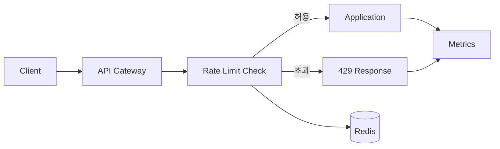

# Rate Limiting

- **목적:** API 요청량을 제한해 서버 과부하, 비용 폭증, 무차별 대입 공격을 막는다.
- **핵심 설계:** 제한 기준(사용자·IP·API 키), 윈도우 방식, 저장소 일관성, 초과 시 응답 정책을 함께 결정한다.
- **트러블슈팅 관점:** `429` 증가만 보지 말고 제한 키의 편중, 서버 간 카운터 불일치, 재시도 폭풍, 프록시의 IP 전달 오류를 확인한다.

## 개념 설명

Rate limiting은 일정 시간 동안 허용할 요청 수를 제어하는 기법이다. 예를 들어 “사용자별 초당 10회” 또는 “IP별 분당 100회”처럼 정책을 정의한다. 제한 초과 시 일반적으로 HTTP `429 Too Many Requests`를 반환하고, `Retry-After` 헤더로 재시점 정보를 제공한다.

대표 알고리즘은 다음과 같다.

- **Fixed Window:** 1분 단위 카운터를 초기화한다. 구현이 쉽지만 경계 시점에 짧은 시간 동안 허용량의 두 배가 몰릴 수 있다.
- **Sliding Window:** 최근 일정 시간을 기준으로 계산해 경계 문제를 줄인다. 로그 저장 비용과 계산량이 증가한다.
- **Token Bucket:** 일정 속도로 토큰을 충전하고 요청마다 토큰을 소비한다. 평균 속도와 순간 버스트를 함께 제어하기 좋다.
- **Leaky Bucket:** 큐에서 일정한 속도로 처리해 트래픽을 평탄화한다. 지연이 늘어날 수 있다.

실무에서는 단일 애플리케이션 메모리보다 Redis 같은 공유 저장소를 사용해야 여러 인스턴스가 동일한 제한을 적용한다. 카운터 증가와 만료 설정은 원자적으로 처리하고, Redis 장애 시에는 “요청 차단”과 “일시 허용” 중 보안·가용성 우선순위를 정한다.

장애 분석 시 먼저 응답 코드, 제한 키, 엔드포인트, 리전별 `429` 비율을 분리한다. 특정 고객만 실패하면 키 생성 로직이나 트래픽 급증을 확인하고, 전체 고객이 실패하면 Redis 지연·장애, 배포 후 설정 변경, 프록시 헤더를 점검한다. NAT 환경에서는 여러 사용자가 하나의 공인 IP를 공유하므로 IP 기준만 사용하면 정상 사용자가 함께 차단될 수 있다. 클라이언트는 `429`를 즉시 반복하지 말고 지수 백오프와 지터를 적용해야 재시도 폭풍을 피할 수 있다.

## 코드 예시

```python
def allow(redis, key, limit=10, window=1):
    now = time.time()
    redis.zremrangebyscore(key, 0, now - window)
    count = redis.zcard(key)
    if count >= limit:
        return False
    pipe = redis.pipeline()
    pipe.zadd(key, {str(uuid.uuid4()): now})
    pipe.expire(key, window + 1)
    pipe.execute()
    return True
```

## 처리 흐름



## 면접 질문

### 1. 여러 서버에서 Rate Limiting을 메모리로 구현하면 왜 문제가 되나요?

인스턴스마다 카운터가 따로 증가해 전체 요청량을 정확히 제한할 수 없다. 공유 Redis나 게이트웨이 계층에서 원자적인 카운터를 사용해야 한다.

### 2. `429` 응답을 받은 클라이언트는 어떻게 재시도해야 하나요?

`Retry-After`를 우선 따르고, 없으면 지수 백오프와 무작위 지터를 적용한다. 모든 클라이언트가 동시에 재시도하지 않도록 해야 한다.

> **한 줄 정리:** Rate limiting은 단순한 카운터가 아니라, 트래픽 제어·장애 격리·재시도 정책까지 포함한 운영 설계다.
