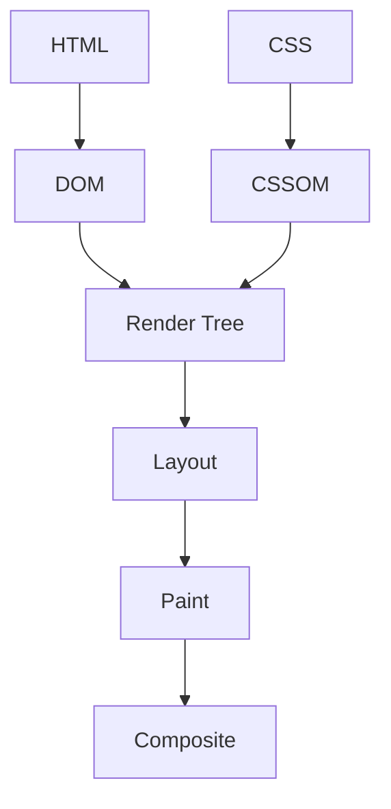

# 브라우저 렌더링

- 브라우저는 HTML을 DOM, CSS를 CSSOM으로 변환한 뒤 렌더 트리를 만든다.
- 렌더 트리를 기준으로 레이아웃, 페인트, 합성 단계를 수행해 화면을 출력한다.
- JavaScript, CSS, 레이아웃 변경은 렌더링을 지연하거나 반복시킬 수 있으므로 실행 시점을 관리해야 한다.

## 개념 설명

브라우저 렌더링은 네트워크에서 받은 문서를 사용자가 볼 수 있는 픽셀로 바꾸는 과정이다. 먼저 HTML 파싱 결과로 **DOM 트리**를 만들고, CSS 파싱 결과로 **CSSOM 트리**를 만든다. CSS 선택자 계산이 끝나면 화면에 실제로 표시되는 요소만 모아 **렌더 트리**를 구성한다. `display: none` 요소는 렌더 트리에 포함되지 않지만, `visibility: hidden` 요소는 공간을 차지하므로 포함된다.

이후 **레이아웃** 단계에서 각 요소의 위치와 크기를 계산한다. 레이아웃 결과를 바탕으로 색상, 테두리, 그림자, 글자 등을 **페인트**하고, 여러 레이어를 GPU가 합성해 최종 화면을 만든다.

레이아웃 결과에 영향을 주는 변경은 **리플로우**를 발생시킨다. 리플로우 후에는 보통 다시 페인트가 필요하므로 비용이 크다. 배경색처럼 위치와 크기에 영향을 주지 않는 변경은 **리페인트**만 유발할 수 있다. `transform`, `opacity`는 별도 레이어에서 처리되면 레이아웃과 페인트를 줄이고 합성만 수행할 가능성이 높다.

JavaScript가 실행 중 DOM 파싱을 방해하면 화면 표시가 늦어진다. 일반 스크립트는 HTML 파싱을 중단하지만, `defer`는 HTML 파싱과 병렬로 다운로드한 뒤 파싱 완료 후 실행된다. 따라서 초기 스크립트에는 `defer`를 우선 고려한다.

DOM을 반복해서 수정하거나, 스타일 변경 직후 `offsetHeight` 같은 레이아웃 값을 읽으면 브라우저가 강제로 레이아웃을 계산할 수 있다. 여러 변경을 한 번에 처리하고, 애니메이션에는 `transform`과 `opacity`를 사용하는 것이 효과적이다.

```js
const box = document.querySelector('.box');
const button = document.querySelector('button');

button.addEventListener('click', () => {
  // 여러 스타일 변경을 한 번에 적용
  box.classList.add('active');
  requestAnimationFrame(() => {
    box.style.transform = 'translateX(200px)';
    box.style.opacity = '0.5';
  });
});
```



## 면접 질문

### 1. 리플로우와 리페인트의 차이는 무엇인가?

리플로우는 요소의 크기나 위치를 다시 계산하는 과정이고, 리페인트는 계산된 영역을 다시 그리는 과정이다. 일반적으로 리플로우가 더 큰 비용을 유발하며, 리플로우 후 리페인트가 이어질 수 있다.

### 2. `defer`와 일반 `script`의 차이는 무엇인가?

일반 `script`는 다운로드와 실행 중 HTML 파싱을 중단한다. `defer`는 다운로드를 병렬 처리하고 HTML 파싱이 끝난 뒤 실행하므로 초기 렌더링을 덜 방해한다.

> **한 줄 정리:** 브라우저 렌더링 성능은 DOM·CSS 변경을 줄이고, 레이아웃 계산을 피하며, 합성 중심 속성을 활용하는 데서 결정된다.
