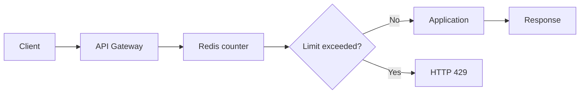

# Rate Limiting

- **목적:** API 호출량을 제한해 서버 과부하, 비용 폭증, 무차별 대입 공격을 방지한다.
- **핵심 설계:** 사용자·IP·API 키별 한도, 시간 창, 초과 시 응답 정책을 정의한다.
- **현업 포인트:** 단일 서버 메모리보다 Redis 같은 공유 저장소를 사용하고, 프록시·API Gateway 계층에서 우선 적용한다.

## 개념 설명

Rate limiting은 특정 주체가 일정 시간 동안 수행할 수 있는 요청 수를 제한하는 기법이다. 예를 들어 로그인 API는 `IP당 1분 10회`, 결제 API는 `사용자당 1분 30회`, 일반 조회 API는 `API 키당 1분 1,000회`처럼 정책을 다르게 적용한다.

대표 알고리즘은 다음과 같다.

- **Fixed Window:** 정해진 시간 구간마다 카운터를 초기화한다. 구현이 쉽지만 구간 경계에서 순간적으로 한도가 두 배까지 허용될 수 있다.
- **Sliding Window:** 최근 일정 시간의 요청만 계산해 더 정확하지만 저장·계산 비용이 증가한다.
- **Token Bucket:** 일정 속도로 토큰을 충전하고 요청마다 토큰을 소비한다. 순간적인 버스트를 허용하면서 평균 처리율을 제한해 실무에서 자주 사용된다.
- **Leaky Bucket:** 요청을 일정한 속도로 배출해 트래픽을 평탄화한다. 지연이 발생할 수 있지만 백엔드 보호에 유리하다.

분산 환경에서는 각 애플리케이션 인스턴스가 별도 카운터를 가지면 제한이 우회된다. 따라서 Redis의 `INCR`, TTL, Lua 스크립트 또는 API Gateway의 분산 정책을 사용해 카운터 갱신과 만료 설정을 원자적으로 처리해야 한다. 초과 요청에는 일반적으로 **HTTP 429 Too Many Requests**와 `Retry-After` 헤더를 반환한다.

현업에서는 로그인·회원가입·비밀번호 재설정처럼 공격 가능성이 높은 API를 가장 엄격하게 제한한다. 반면 내부 배치나 신뢰된 서비스에는 별도 API 키와 높은 한도를 부여한다. 한도 초과를 단순히 차단하지 않고 큐에 넣거나 지수 백오프 재시도를 유도할 수도 있다. 또한 허용량, 차단 수, 429 비율, 주요 클라이언트별 사용량을 모니터링해야 한다. NAT 환경에서는 IP만 기준으로 삼으면 정상 사용자가 함께 제한될 수 있으므로 사용자 ID, API 키, 디바이스 식별자와 조합한다.

## 코드 예시: Redis 기반 Fixed Window 미들웨어

```js
async function rateLimit(req, res, next) {
  const key = `rl:${req.user?.id ?? req.ip}`;
  const count = await redis.incr(key);

  if (count === 1) await redis.expire(key, 60);
  if (count > 100) {
    const ttl = await redis.ttl(key);
    res.set("Retry-After", String(ttl));
    return res.status(429).json({ error: "Too Many Requests" });
  }
  next();
}
```

## 요청 흐름



## 면접 질문

### 1. 분산 서버에서 애플리케이션 로컬 메모리만 사용하면 왜 문제가 되나요?

서버마다 카운터가 달라져 전체 한도가 일관되게 적용되지 않는다. Redis나 Gateway처럼 공유되는 계층이 필요하다.

### 2. HTTP 429 응답에 `Retry-After`를 포함하는 이유는 무엇인가요?

클라이언트가 재시도 가능한 시점을 알 수 있어 무의미한 반복 요청과 추가 부하를 줄일 수 있다.

> **한 줄 정리:** Rate limiting은 적절한 키·알고리즘·분산 저장소·429 정책을 조합해 서비스 안정성과 공정한 자원 사용을 보장하는 기술이다.
