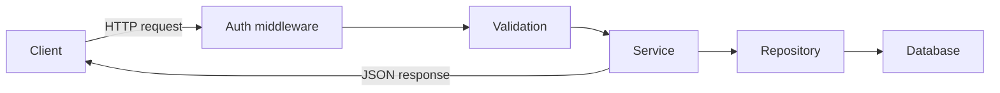

# REST API 설계

- **리소스 중심 URI**를 사용하고, 동작은 HTTP 메서드로 표현한다.
- 상태 코드와 일관된 응답 형식으로 성공·실패를 명확히 구분한다.
- 검증, 페이지네이션, 멱등성, 권한을 설계 단계에서 고려한다.

## 개념 설명

REST API는 클라이언트가 리소스를 HTTP로 조작하는 인터페이스다. URI에는 동사가 아니라 명사를 사용한다. 예를 들어 `GET /users/42`는 특정 사용자를 조회하고, `POST /users`는 사용자를 생성한다. `GET`은 조회, `POST`는 생성, `PUT`은 전체 수정, `PATCH`는 부분 수정, `DELETE`는 삭제에 사용한다.

상태 코드는 의미에 맞게 선택한다. 생성 성공은 `201 Created`, 삭제 성공은 `204 No Content`, 잘못된 요청은 `400 Bad Request`, 인증 실패는 `401 Unauthorized`, 권한 부족은 `403 Forbidden`, 리소스 없음은 `404 Not Found`, 중복 충돌은 `409 Conflict`가 적절하다.

응답 구조는 엔드포인트마다 흔들리지 않게 유지한다. 오류는 사람이 읽을 메시지와 프로그램이 처리할 오류 코드를 함께 제공한다. 목록 API는 `page`, `size`, `sort` 같은 쿼리 파라미터를 사용하고, 대량 데이터는 기본 최대 크기를 제한한다. API 버전은 `/api/v1/users` 또는 헤더로 관리할 수 있다.

`PUT`과 `DELETE`처럼 같은 요청을 여러 번 보내도 결과가 같아야 하는 작업은 멱등성을 보장하기 쉽다. 결제나 주문 생성처럼 중복 실행이 위험한 `POST`에는 `Idempotency-Key`를 적용하는 것이 안전하다. 또한 인증과 권한 검사는 컨트롤러 내부에 흩뜨리지 말고 미들웨어나 정책 계층으로 분리한다.

## 코드 예제

```js
app.get("/api/v1/users", async (req, res) => {
  const page = Math.max(Number(req.query.page) || 1, 1);
  const size = Math.min(Number(req.query.size) || 20, 100);
  const result = await userService.findPage({ page, size });
  res.status(200).json({
    data: result.items,
    pagination: { page, size, total: result.total }
  });
});

app.post("/api/v1/users", async (req, res) => {
  const parsed = userSchema.safeParse(req.body);
  if (!parsed.success) {
    return res.status(400).json({
      error: { code: "INVALID_INPUT", message: "입력값이 올바르지 않습니다." }
    });
  }
  const user = await userService.create(parsed.data);
  res.status(201).location(`/api/v1/users/${user.id}`).json({ data: user });
});
```

## 요청 흐름



## 면접 질문

### 1. `PUT`과 `PATCH`의 차이는?

`PUT`은 리소스 전체를 교체하는 의미이고, `PATCH`는 일부 필드만 수정하는 의미다. 부분 수정 API에 `PUT`을 사용하면 누락된 필드가 의도치 않게 초기화될 수 있다.

### 2. `401`과 `403`은 어떻게 다른가?

`401`은 인증 정보가 없거나 유효하지 않은 상태다. `403`은 인증은 되었지만 해당 리소스에 접근할 권한이 없는 상태다.

> **한 줄 정리:** 좋은 REST API는 리소스·HTTP 의미·응답 형식을 일관되게 설계해 예측 가능한 계약을 제공한다.
