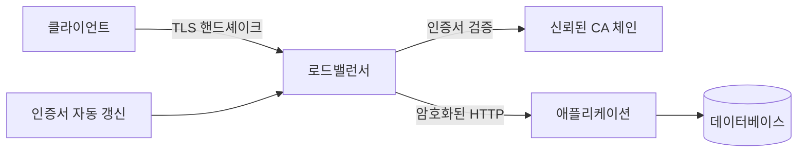

# HTTPS와 인증서

- **HTTPS는 HTTP를 TLS로 감싼 통신**으로, 암호화·서버 인증·메시지 무결성을 제공한다.
- **인증서의 핵심은 공개키와 도메인 검증**이며, 브라우저는 신뢰할 수 있는 CA까지 인증서 체인을 검증한다.
- 현업에서는 **로드밸런서에서 TLS를 종료**하고, 인증서 자동 갱신·만료 모니터링·내부 구간 암호화를 함께 관리한다.

## 개념 설명

HTTPS 연결 시 클라이언트는 서버 인증서를 받는다. 인증서에는 도메인, 유효 기간, 서버 공개키, 발급자 정보가 포함된다. 브라우저는 인증서의 도메인이 접속 주소와 일치하는지, 만료되지 않았는지, 서명이 신뢰할 수 있는 CA로 이어지는지 확인한다. 이 과정을 통과하면 TLS 핸드셰이크에서 세션 키를 협상하고, 이후 HTTP 요청·응답을 대칭키로 암호화한다.

인증서에는 공개키만 포함되며, 서버는 대응하는 **개인키를 절대 외부에 노출하면 안 된다**. 개인키가 유출되면 공격자가 서버를 가장할 수 있다. 따라서 파일 권한, Secret Manager, HSM 등을 사용해 보호한다.

실무에서는 클라이언트와 애플리케이션 서버 사이에 ALB, Nginx, API Gateway가 위치해 TLS를 종료하는 경우가 많다. 이때 외부 구간만 HTTPS로 만들면 내부 네트워크의 평문 통신이 남을 수 있으므로, 개인정보·결제·제로 트러스트 환경에서는 프록시와 서비스 간에도 HTTPS 또는 mTLS를 적용한다.

인증서는 Let’s Encrypt 같은 공개 CA에서 자동 발급·갱신할 수 있다. 운영 장애의 흔한 원인은 인증서 만료, 중간 인증서 누락, 잘못된 SAN 도메인, 로드밸런서별 설정 불일치다. 만료일을 메트릭과 알림으로 감시하고, 갱신 후 실제 도메인에 배포됐는지 자동 검증해야 한다.

```bash
# 인증서 체인과 만료일 확인
openssl s_client -connect api.example.com:443 \
  -servername api.example.com </dev/null 2>/dev/null |
  openssl x509 -noout -subject -issuer -dates

# HTTP 리다이렉트와 TLS 인증서 확인
curl -I http://api.example.com
curl -v https://api.example.com/health
```



## 면접 질문

### 1. HTTPS가 제공하는 보안 속성은 무엇인가?

암호화로 도청을 막고, 인증서로 접속 서버의 신원을 확인하며, MAC 또는 AEAD 검증으로 통신 중 변조를 탐지한다. 단, 서버 내부 권한 통제나 애플리케이션 취약점까지 해결하지는 않는다.

### 2. 인증서가 유효한데도 HTTPS 접속이 실패하는 원인은?

접속 도메인이 SAN과 다르거나, 중간 인증서가 누락됐거나, 인증서가 만료됐을 수 있다. 또한 SNI별 인증서 설정 오류, TLS 버전·암호군 불일치, 클라이언트의 신뢰 저장소 문제도 확인한다.

> **한 줄 정리:** HTTPS는 인증서로 서버를 검증하고 TLS로 통신을 보호하므로, 운영에서는 안전한 키 관리와 인증서 자동 갱신까지가 핵심이다.
