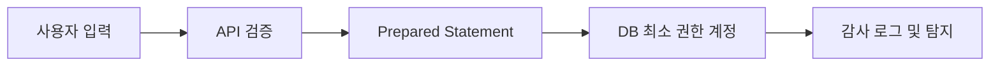

# SQL Injection

## 핵심 포인트

- 사용자 입력을 SQL 문자열에 직접 결합하면 공격자가 조건문이나 명령을 주입할 수 있다.
- 가장 확실한 방어는 **Prepared Statement 기반 파라미터 바인딩**이며, ORM을 사용해도 문자열 조합은 피해야 한다.
- 운영 환경에서는 코드 수정뿐 아니라 최소 권한, 입력 검증, 로그·탐지, 테스트까지 함께 적용해야 한다.

## 개념 설명

SQL Injection은 애플리케이션이 사용자 입력을 SQL 문법과 데이터로 구분하지 못할 때 발생한다. 예를 들어 로그인 쿼리에 아이디와 비밀번호를 문자열로 붙이면 입력값이 `OR` 조건이나 주석 구문으로 해석되어 인증 우회가 가능해진다. 단순 조회를 넘어 개인정보 노출, 데이터 변조·삭제, 관리자 권한 획득으로 이어질 수 있어 OWASP의 대표적인 웹 취약점으로 분류된다.

현업에서는 로그인, 검색, 게시판 필터, 관리자 화면의 엑셀 다운로드 조건에서 자주 발견된다. 특히 레거시 JDBC 코드, 동적 SQL을 직접 만드는 리포지터리, 배치 스크립트가 위험하다. JPA나 MyBatis도 안전하다고 단정할 수 없다. JPA의 네이티브 쿼리 문자열 결합, MyBatis의 `${}`는 입력값이 SQL 구조에 포함될 수 있으므로 주의해야 한다. 값은 `#{}` 또는 바인딩 변수로 전달해야 한다.

정렬 컬럼명이나 테이블명처럼 바인딩할 수 없는 식별자는 허용 목록으로 매핑한다. 예를 들어 `sort=createdAt`만 `created_at`으로 변환하고, 그 외 값은 거부한다. 데이터베이스 계정에는 필요한 테이블과 명령만 부여하며, 애플리케이션 계정으로 DDL·관리자 권한을 사용하지 않는다. 발견 시에는 의심 요청 로그, 비정상 응답, DB 감사 로그를 확인하고 토큰·비밀번호 재설정과 영향 범위 분석을 병행한다.

## 코드 예시

```java
// 취약: 입력값이 SQL 구조에 포함됨
String sql = "SELECT id FROM users WHERE email='" + email + "'";
Statement st = conn.createStatement();
ResultSet rs = st.executeQuery(sql);

// 안전: 값은 SQL 문법과 분리하여 바인딩
String safeSql = "SELECT id FROM users WHERE email = ?";
PreparedStatement ps = conn.prepareStatement(safeSql);
ps.setString(1, email);
ResultSet safeRs = ps.executeQuery();
```



## 면접 질문

### 1. ORM을 사용하면 SQL Injection이 사라지나요?

아니다. 파라미터 바인딩을 사용하면 안전하지만, 네이티브 SQL 문자열 결합이나 MyBatis `${}`처럼 SQL 구조에 입력을 삽입하면 여전히 취약하다.

### 2. Prepared Statement만으로 모든 SQL Injection을 막을 수 있나요?

값 영역에는 효과적이지만 테이블명·컬럼명·정렬 방향은 직접 바인딩할 수 없다. 이 경우 허용 목록 매핑과 입력 검증을 함께 적용해야 한다.

## 한 줄 정리

**사용자 입력은 SQL 문자열에 결합하지 말고 바인딩하며, 식별자는 허용 목록과 최소 권한으로 통제하라.**
