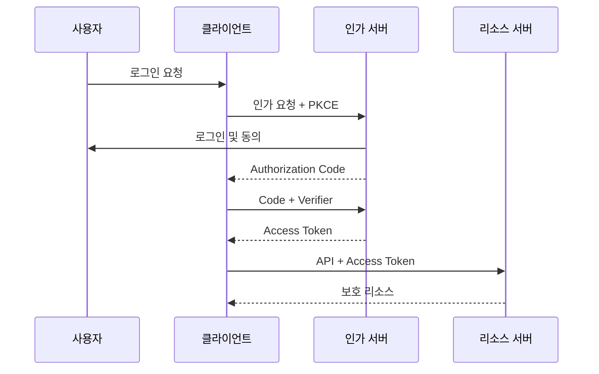

# OAuth 2.0 내부 구현 관점

- OAuth 2.0은 **사용자 인증 자체가 아니라 권한 위임**을 위한 인가 프레임워크다.
- Authorization Code + PKCE가 현재 웹·모바일 클라이언트의 기본 선택이다.
- 액세스 토큰은 짧게, 리프레시 토큰은 안전하게 저장하고 회전시켜야 한다.

## 개념 설명

OAuth 2.0에는 네 가지 주요 역할이 있다. **Resource Owner**는 데이터의 소유자이며 일반적으로 사용자다. **Client**는 사용자를 대신해 API를 호출하는 애플리케이션이다. **Authorization Server**는 로그인과 동의를 처리하고 토큰을 발급한다. **Resource Server**는 액세스 토큰을 검증한 뒤 보호된 리소스를 반환한다.

Authorization Code 흐름에서 클라이언트는 먼저 `state`, `code_challenge`와 함께 인가 엔드포인트로 리다이렉트한다. 사용자가 로그인하고 동의하면 Authorization Server는 콜백 URL로 일회성 `code`를 전달한다. 클라이언트는 이 코드를 토큰 엔드포인트에 보내 액세스 토큰을 교환한다. PKCE에서는 최초에 생성한 `code_verifier`를 함께 제출한다. 서버는 `BASE64URL(SHA256(code_verifier))`가 저장된 `code_challenge`와 일치하는지 검사하므로, 중간에서 인가 코드를 탈취해도 재사용하기 어렵다.

서버 내부에서 인가 코드는 사용자 ID, 클라이언트 ID, 리다이렉트 URI, scope, PKCE challenge, 만료 시각을 저장한 임시 레코드다. 교환이 성공하면 즉시 삭제하거나 재사용 여부를 표시해야 한다. 액세스 토큰은 불투명한 랜덤 문자열을 DB에서 조회하거나, JWT라면 서명·`iss`·`aud`·`exp`·scope를 검증한다. JWT는 빠른 로컬 검증이 가능하지만 즉시 폐기가 어렵고, 불투명 토큰은 중앙 조회 비용이 있다.

`redirect_uri`는 등록된 값과 정확히 비교해야 하며, 임의 URI를 허용하면 인가 코드 탈취로 이어진다. `state`는 CSRF 방어용으로 세션에 저장한 값과 콜백 값을 비교한다. 리프레시 토큰은 평문 대신 해시로 저장하고, 사용 때마다 새 토큰으로 교체하는 rotation을 적용한다. 이전 토큰이 다시 사용되면 탈취를 의심해 해당 토큰 체인을 폐기할 수 있다. 클라이언트 시크릿을 안전하게 보관할 수 없는 SPA·모바일 앱은 public client로 취급하고 PKCE를 사용한다.

## 구현 예시: PKCE 검증 핵심

```python
challenge = base64url(sha256(verifier))
record = auth_codes.get(code)

if not record or record.expires_at < now():
    raise InvalidGrant()
if record.used or record.client_id != client_id:
    raise InvalidGrant()
if record.redirect_uri != redirect_uri:
    raise InvalidGrant()
if not constant_time_equal(challenge, record.code_challenge):
    raise InvalidGrant()

record.used = True
return issue_tokens(record.user_id, record.scope)
```

## 흐름



## 면접 질문

1. **OAuth와 OpenID Connect의 차이는?**  
   OAuth는 API 접근 권한 위임이고, OIDC는 OAuth 위에 ID Token과 사용자 인증 표준을 추가한 인증 프로토콜이다.

2. **PKCE가 필요한 이유는?**  
   Authorization Code가 탈취되어도 원래 클라이언트만 가진 `code_verifier`가 없으면 토큰으로 교환할 수 없게 하기 위해서다.

> **한 줄 요약:** OAuth 2.0의 핵심은 토큰 발급보다 `redirect_uri`, `state`, PKCE, 토큰 수명·폐기를 정확히 검증하는 것이다.
