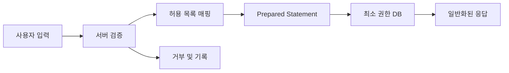

# SQL Injection: 자주 하는 실수와 안티패턴

- 사용자 입력을 문자열 연결로 SQL에 삽입하면 공격자가 쿼리 구조를 바꿀 수 있다.
- `PreparedStatement`를 사용해도 테이블명·정렬 기준 같은 식별자를 직접 조합하면 여전히 위험하다.
- ORM 사용만으로 안전해지지 않으며, 권한 최소화와 오류·로그 관리까지 함께 적용해야 한다.

## 개념 설명

SQL Injection은 신뢰할 수 없는 입력이 SQL 문법으로 해석되는 취약점이다. 예를 들어 로그인 입력에 `' OR '1'='1`을 넣으면 조건이 항상 참이 되도록 쿼리가 변형될 수 있다. 단순 조회뿐 아니라 인증 우회, 민감 데이터 조회·수정, 삭제, DB 계정 권한에 따른 서버 공격으로 이어질 수 있다.

가장 흔한 안티패턴은 다음과 같다.

1. **문자열 연결**: 입력값을 따옴표로 감싸는 것만으로 방어하려 한다. 특수문자 처리 누락과 인코딩 차이 때문에 안전하지 않다.
2. **수동 이스케이프**: DB별 규칙에 의존하며, 누락·우회 가능성이 있다. 이스케이프는 최후의 보완책이지 기본 방어가 아니다.
3. **부분적인 파라미터화**: `WHERE` 값은 바인딩하면서 `ORDER BY`, 테이블명, 컬럼명은 사용자 입력을 그대로 붙인다. 식별자는 바인드 변수로 처리할 수 없으므로 허용 목록으로 매핑해야 한다.
4. **ORM 맹신**: ORM의 안전한 API 대신 원시 SQL, 문자열 기반 필터, 동적 쿼리 기능을 사용하면 취약해질 수 있다.
5. **과도한 DB 권한**: 조회 전용 기능이 관리자 계정으로 접속하면 취약점의 피해 범위가 커진다.
6. **상세 오류 노출**: SQL 문장, 스키마, 드라이버 오류를 사용자에게 반환하면 공격자에게 구조를 알려준다.

기본 원칙은 값과 SQL 구조를 분리하는 것이다. 값은 준비된 문장의 바인드 변수로 전달하고, 동적 식별자는 서버 측 허용 목록에서 선택한다. 또한 입력 형식 검증, 최소 권한 계정, 일반화된 오류 응답, 보안 테스트를 함께 적용한다. 검증은 방어 계층이며 파라미터화의 대체물이 아니다.

```python
# 안전하지 않은 패턴
sql = "SELECT id FROM users WHERE email = '" + email + "'"

# 안전한 패턴: 값은 바인딩
sql = "SELECT id FROM users WHERE email = %s"
cursor.execute(sql, (email,))

# 동적 정렬은 허용 목록으로 매핑
sort_map = {"name": "name", "created": "created_at"}
order_by = sort_map.get(request.args.get("sort"), "created_at")
cursor.execute(
    f"SELECT id, name FROM users ORDER BY {order_by} LIMIT %s",
    (20,)
)
```



## 면접 질문

### 1. Prepared Statement가 SQL Injection을 막는 원리는?

SQL 구조를 먼저 컴파일하고 입력값을 데이터로 바인딩하기 때문이다. 따라서 입력에 SQL 키워드가 포함되어도 쿼리 구조로 해석되지 않는다. 단, 문자열로 만든 동적 SQL 자체까지 자동으로 안전하게 만들지는 않는다.

### 2. `ORDER BY ?`처럼 컬럼명을 바인딩하면 되지 않는 이유는?

바인드 변수는 일반적으로 값 위치에만 사용할 수 있고 식별자에는 사용할 수 없기 때문이다. 컬럼명과 정렬 방향은 서버의 허용 목록으로 매핑하고, 나머지 값만 바인딩해야 한다.

> **한 줄 정리:** SQL Injection 방어의 핵심은 문자열 연결을 없애고, 값은 바인딩하며, 동적 식별자는 허용 목록과 최소 권한으로 통제하는 것이다.
