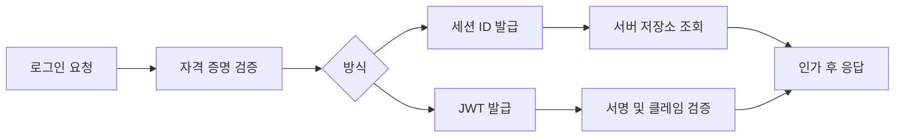

# JWT와 세션: 내부 구현 관점

- **세션**은 쿠키에 저장된 식별자로 서버 저장소의 인증 상태를 조회한다.
- **JWT**는 `header.payload.signature` 자체에 인증 정보를 담고, 서버는 서명 검증으로 위변조를 확인한다.
- JWT는 무조건 더 좋은 방식이 아니다. 폐기, 갱신, 저장 위치, CSRF/XSS 대응까지 함께 설계해야 한다.

## 개념 설명

### 1. 세션의 내부 동작

로그인에 성공하면 서버는 랜덤하고 예측 불가능한 세션 ID를 생성한다. 이 ID와 사용자 ID, 만료 시각, 권한 등을 Redis나 DB에 저장한 뒤 브라우저에 다음과 같은 쿠키를 전달한다.

```http
Set-Cookie: sid=랜덤값; HttpOnly; Secure; SameSite=Lax
```

이후 요청마다 브라우저가 `sid`를 자동 전송하면 서버는 저장소에서 세션을 조회한다. 쿠키에는 의미 있는 사용자 정보가 없으므로 탈취된 ID 자체가 공격의 핵심 자산이다. 로그아웃은 서버 저장소에서 세션을 삭제하면 즉시 처리된다. 다만 서버 저장소 조회와 세션 클러스터링이 필요하다.

로그인 직후 세션 ID를 재발급하는 **세션 고정 공격 방어**가 중요하다. `HttpOnly`는 자바스크립트의 쿠키 접근을 막고, `Secure`는 HTTPS에서만 전송하며, `SameSite`는 CSRF 위험을 줄인다.

### 2. JWT의 내부 구조

JWT는 점(`.`)으로 연결된 세 부분이다.

```text
base64url(header) .
base64url(payload) .
base64url(HMAC 또는 RSA 서명)
```

헤더에는 알고리즘과 타입, 페이로드에는 `sub`, `iat`, `exp`, `aud` 같은 클레임이 들어간다. 서명은 일반적으로 `header와 payload를 인코딩한 문자열`에 대해 계산한다. 서버는 비밀키 또는 공개키로 서명을 검증하지만, JWT는 암호화가 아니라 **서명**이므로 payload를 누구나 디코딩할 수 있다. 비밀번호나 개인정보를 넣으면 안 된다.

검증 시 알고리즘을 토큰 값에 무조건 위임하지 말고 허용 목록을 고정한다. `exp` 만료, `iss` 발급자, `aud` 대상, 서명, 필요한 권한을 모두 확인해야 한다.

### 3. 운영상 트레이드오프

JWT는 서버 저장소 조회 없이 검증할 수 있어 여러 API 서버에 유리하지만, 이미 발급한 토큰을 즉시 폐기하기 어렵다. 짧은 만료 시간의 액세스 토큰과 서버가 관리하는 리프레시 토큰을 조합하는 방식이 흔하다. 리프레시 토큰은 재사용 감지와 **rotation**을 적용하고, 탈취 시 이전 토큰 계열을 폐기한다.

브라우저에서는 JWT를 `localStorage`에 저장하면 XSS로 탈취될 수 있다. HttpOnly 쿠키를 사용하면 XSS의 직접 접근은 줄지만, 쿠키 자동 전송으로 CSRF를 고려해야 한다. 따라서 SameSite, CSRF 토큰, 적절한 CORS 정책을 함께 설계한다.

## 코드 예시

```js
function verifyAccessToken(token) {
  const [h, p, sig] = token.split(".");
  const header = JSON.parse(base64urlDecode(h));
  const payload = JSON.parse(base64urlDecode(p));

  if (header.alg !== "RS256") throw new Error("algorithm");
  if (!rsaVerify(`${h}.${p}`, sig, PUBLIC_KEY)) throw new Error("signature");
  if (payload.exp <= Math.floor(Date.now() / 1000)) throw new Error("expired");
  if (payload.iss !== "auth.example") throw new Error("issuer");
  return payload;
}
```

## 인증 흐름



## 인터뷰 질문

### Q1. JWT는 서버에서 즉시 로그아웃할 수 없는 이유는?

A. 발급 후 토큰이 클라이언트에 존재하고, 서버가 상태를 저장하지 않으면 해당 토큰의 존재를 추적하지 않기 때문이다. 짧은 만료 시간, 블랙리스트, 리프레시 토큰 폐기 등으로 보완한다.

### Q2. JWT payload를 Base64URL로 디코딩할 수 있는데 안전한가?

A. Base64URL은 인코딩일 뿐 암호화가 아니다. 누구나 내용을 읽을 수 있으며, 위변조 방지만 서명이 담당한다. 기밀 데이터는 별도 암호화하거나 토큰에 넣지 않는다.

> **한 줄 요약:** 세션은 서버가 상태를 관리하고, JWT는 토큰이 상태를 운반하므로 폐기·저장·CSRF/XSS까지 포함해 선택해야 한다.
