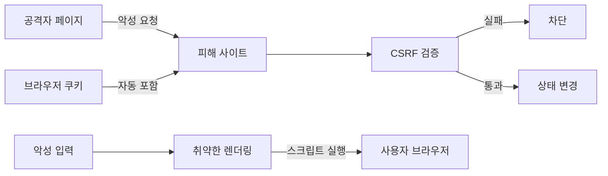

# XSS와 CSRF: 자주 하는 실수와 안티패턴

- **XSS**는 공격자의 스크립트가 사용자의 브라우저에서 실행되는 문제이고, **CSRF**는 사용자의 인증 권한을 악용해 원치 않는 요청을 보내는 문제다.
- `innerHTML` 금지나 CORS 설정만으로는 충분하지 않다. **출력 컨텍스트별 인코딩, 쿠키 정책, CSRF 토큰**을 함께 적용해야 한다.
- “프런트엔드에서만 검증”, “토큰을 쿠키에만 저장”, “GET으로 상태 변경”은 대표적인 안티패턴이다.

## 개념 설명

### XSS

XSS는 신뢰하지 않는 입력이 HTML, JavaScript, URL, CSS 등의 문맥에 섞여 실행되는 취약점이다. 저장형 XSS는 게시글·댓글 등에 저장되어 여러 사용자에게 퍼지고, 반사형 XSS는 요청 파라미터가 즉시 응답에 포함된다. DOM 기반 XSS는 서버 응답과 무관하게 클라이언트 코드가 위험한 DOM API를 호출하면서 발생한다.

가장 흔한 실수는 사용자 입력을 `innerHTML`로 삽입하거나 템플릿에서 “안전한 HTML”로 취급하는 것이다. 단순히 `<script>` 문자열만 제거하는 블랙리스트 필터는 이벤트 핸들러, SVG, 인코딩 우회에 취약하다. 가능하면 `textContent`를 사용하고, HTML이 필요하면 검증된 sanitizer를 사용한다. 출력 인코딩은 입력 시점이 아니라 **출력 컨텍스트에 맞춰** 적용해야 한다. CSP는 피해를 줄이는 방어 계층이지 취약한 렌더링을 대체하지 않는다.

### CSRF

CSRF는 브라우저가 자동으로 포함하는 세션 쿠키를 이용해 공격 사이트가 피해 사이트로 상태 변경 요청을 보내는 공격이다. 비밀번호 변경, 송금, 이메일 변경 같은 작업이 대상이다. 공격자는 응답을 읽지 못해도 요청 자체를 발생시킬 수 있다.

`SameSite=Lax/Strict` 쿠키와 CSRF 토큰을 함께 사용하고, 서버에서 `Origin` 또는 `Referer`를 보조 검증한다. 토큰을 쿠키에만 저장하고 서버가 그 값만 확인하면 공격자가 동일하게 전송할 수 있어 무의미하다. 토큰은 세션과 연결된 값으로, 별도 요청 헤더나 폼 필드로 전달하고 서버가 비교해야 한다. GET은 조회에만 사용하고 상태 변경은 POST·PUT·DELETE로 제한한다. CORS는 다른 출처의 **응답 읽기**를 제어할 뿐, CSRF 방어 자체가 아니다.

```js
// XSS 방어: 텍스트는 HTML로 해석하지 않는다.
const message = document.querySelector("#message");
message.textContent = userInput;

// CSRF 방어: 서버가 발급한 토큰을 헤더로 전송한다.
await fetch("/profile/email", {
  method: "POST",
  credentials: "same-origin",
  headers: {
    "Content-Type": "application/json",
    "X-CSRF-Token": csrfToken
  },
  body: JSON.stringify({ email })
});
```



## 면접 질문

1. **XSS와 CSRF의 차이는?**  
   XSS는 공격 코드가 피해자의 브라우저에서 실행되는 취약점이고, CSRF는 브라우저의 인증 정보를 이용해 의도하지 않은 요청을 보내는 취약점이다.

2. **CORS를 설정하면 CSRF가 방어되는가?**  
   아니다. CORS는 응답 읽기를 제한할 뿐 요청 발생을 항상 막지 않는다. CSRF 토큰, `SameSite` 쿠키, 출처 검증이 필요하다.

> **한 줄 정리:** XSS는 “실행되는 출력”을 막고, CSRF는 “위조된 상태 변경 요청”을 토큰과 쿠키 정책으로 막는다.
